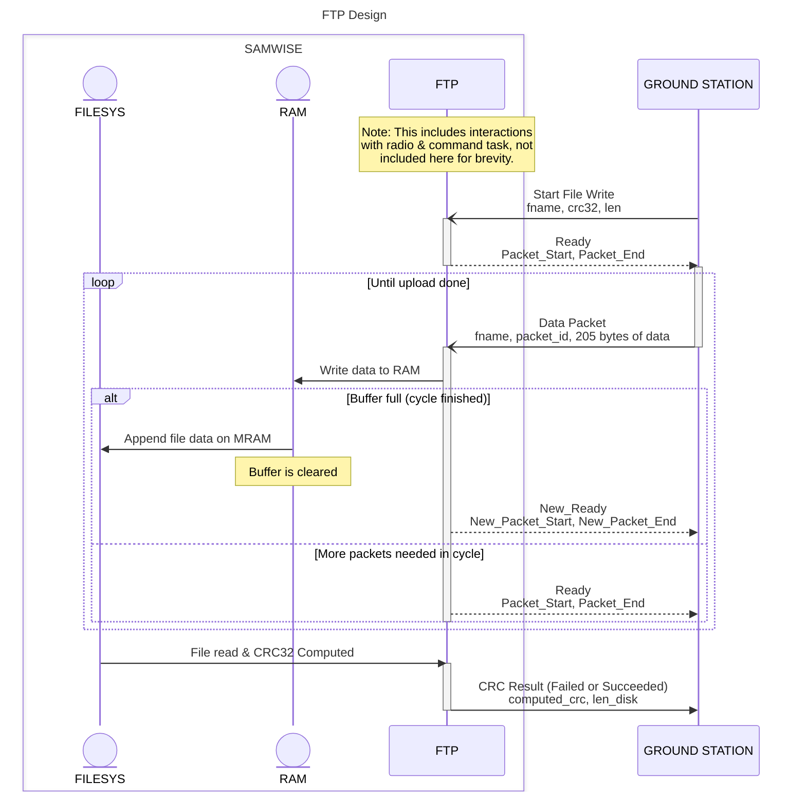
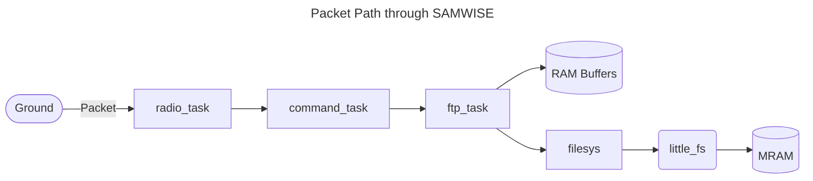
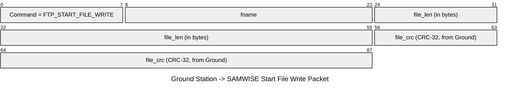
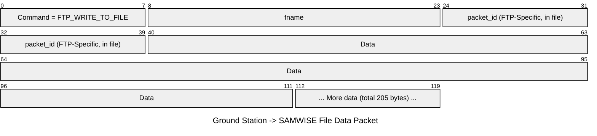

# FTP Implementation
Designed by Ayush Garg, Yao Yiheng, Marc Reyes, in tandem with others; implemented & this doc written mostly by Ayush Garg.

This is a document outlining how we implement our version of FTP, designed for a space satellite.

## Background

This was specifically designed around multiple core concepts:
* Running on low-level, small memory hardware -> need low overhead & NO MALLOCS! (little-fs, see `src/filesys`)
* Potential to drop packets in transit -> resiliance against packet dropping, ability to get data out-of-order
* Low RAM availability -> small file buffers & cyclic implementation
* MRAM life needs to be preserved -> use buffers and write large chunks at once
* One file uploaded at a time, for simplicity's sake (this may be upgraded later)

On the other hand, this was not designed for other common goals, which are not implemented in this design:
* We do not preserve any directory information, and in fact only have 2 bytes per file name
    * Similarly, no file attributes are (currently) implemented, and the filesystem itself (see `src/filesys`) is as simple as possible
* There is no authentication or real security (apart from inbuilt packet monitoring), only CRC is used to verify a file has been uploaded
* Not interoperable with standard FTP servers/clients; this is a custom, minimal protocol tailored for the satellite link.
* No download/read support beyond the write path described here; files are only written or removed, not fetched. 
* Compression has not been implemented (maybe in the future?)

A few notes on this document:
1. See `ftp_task.h` to get in-depth information on how error and success packets are formatted from FTP to the sender.
2. See `config.h` to get information on types & limitations of the protocol, e.g. how many bytes maximum can be sent.

## Overall Design

A file is split into `ceil(File_Size / (205 * 5))` cycles, each of which accepts `5` packets of `205` bytes each, unless it is the last packet.

A buffer of `205 * 5` bytes lives on SAMWISE's RAM, which is used to cache the `5` packets currently being accepted. When packets are recieved, the buffer is flushed to MRAM, cleared, and SAMWISE accepts the next packets in sequence, or ends the file transfer if it is necessary.

The design is, in rough terms, as follows:
1. Start a file write
2. Loop:
    1. Allow N (=5 right now) "packets" of 205 bytes to be written at a time for the file. For example, when the file first starts, it will allow for packets 0..4 inclusive to be written in any order, and store each one in buffer.
    2. Once all packets in this cycle is complete, write to MRAM, and then clear buffer for the next cycle. So in the previous example, now allow packets 5..9 inclusive.
3. Once all cycles are complete, run a CRC32 check between the expected file & the actually writen file. If successful, finally finish the operation.

Here is a relevant flowchart for the design, only showing a full write (for context on how to read a UML sequence diagram, [this](https://creately.com/guides/sequence-diagram-tutorial/) is a good tutorial):


We implement the following functions:
* reformat filesystem
* start file write
* write packet to buffer (automatically writes to file if all packets are recieved)
* cancel file write
* remove file

Note this means we also **do not have** some common functionalities:
* list all files
* upload multiple files at once
* directories
* non-two-byte file names

## Algorithm

### 0. Initialize & reformat
FTP automatically initializes little-fs. On error, it will send FILESYS_INIT_ERROR.

If this is recieved, or for any other reason, you can reformat the entire MRAM. THIS IS DESTRUCTIVE!!

To do so, simply send a FTP_REFORMAT command with no body. If successful, FILESYS_REFORMAT_SUCCESS will be sent - otherwise, FILESYS_REFORMAT_ERROR will be sent.

### 1. Start a file write
To start writing a file, first make sure that no file is currently being written. If one is, FTP will return a FTP_ERROR_ALREADY_WRITING_FILE. 

Otherwise, send a FTP_START_FILE_WRITE command with the following body:
```c
uint16_t fname; // Name of the file, maximum 2 bytes
uint16_t file_len; // Length of the file, maximum 2 bytes
uint32_t file_crc; // CRC32 for file validation after write
```

If successful, we will return FTP_READY_RECEIVE. Otherwise, FTP_ERROR_RECEIVE will be sent, with the nuances described in ftp_task.h.

### 2. Send packets of data & finishing file write
#### Initial Writing
When you first start a file write, it will return the packets currently readable (`Packet_Start` and `Packet_End` inclusive).

Only packets in this range will be accepted, others will fail with an FTP_ERROR_PACKET_OUT_OF_RANGE. **This is VERY important for the ground station to realize/implement, lest an infinite loop of sending incorrect packets clog up the communications.**

If a file is not being written, it will return FTP_ERROR_NOT_WRITING_FILE.

This is the following body for a packet of data:
```c
uint16_t fname; // Name of the file, for reference/checks
uint16_t packet_id; // Packet id, which should fall within Packet_Start and Packet_End.
uint8_t[205] data; // Raw data to be put in this section
```

Note that data_len in the packet is used to determine the length of data - this example only shows the maximum amount, WHICH MUST BE USED FOR NON-FINAL PACKETS. **If the maximum amount is not used, there will be zero-ed out memory in the gap between the end of this packet and the start of the next.** // TODO: Check this in FTP

If an error occurs when writing to buffer, it will return FTP_FILE_WRITE_BUFFER_ERROR.

If successful and not the final packet, it will send FTP_READY_RECEIVE, which reiterates the Packet_Start and Packet_End, as well as contains a bitfield of all packets recieved in this cycle (0s indicate packets needing to be sent).

#### Ending a cycle
If, on the last packet recieved on cycle, a little-fs error occurs, it will return FTP_FILE_WRITE_MRAM_ERROR.

If not on the last cycle and the cycle is completed successfully, it will return FTP_FILE_WRITE_SUCCESS, with a new range of Packet_Start to Packet_End it will now accept.

#### Ending a file
If on the last cycle, we start wrapping up the file writing process.

If a computed CRC32 of the file doesn't match uploaded file_crc, then FTP_EOF_CRC_ERROR will be thrown. If any other error occurs during CRC computation, FTP_FILE_WRITE_MRAM_ERROR is thrown.

Finally, if everything works out, FTP_EOF_SUCCESS is sent, along with the file length on disk and the computed crc.

### 2.1 Cancel file write
If, for any reason, you want to cancel a file write while writing, simply send a FTP_CANCEL_FILE_WRITE with the following body:
```c
uint16_t fname; // Name of the file
```
This will clear the buffer, remove any existing parts of the file from MRAM, and reset FTP to allow for continuation. On success, it returns FTP_CANCEL_SUCCESS - on error, it returns FTP_CANCEL_ERROR.

Note that if the FTP system is completely botched, reformatting should be the best option to attempt to completely fix it.

### 3. Removing a file
// TODO: Implement removing a file
To remove a file, simply send a FTP_REMOVE_FILE command with the following body:
```c
uint16_t fname; // Name of the file
```

This will remove the file from the MRAM, returning a FTP_REMOVE_SUCCESS on completion, or FTP_REMOVE_ERROR if failed. You can always reformat the MRAM to make a last-ditch save & have memory left.

### 4. General errors
Finally, a general error is defined, FTP_ERROR. This is rarely used (not as of time of writing this doc), but should be known to the ground station.

Additionally, many errors include char[] data that may extend after its actual data. These are optional and should be treated as c-strings. Currently, none are implemented, but there may be room for some in the future.

## Packet Path through SAMWISE


## Packet Formatting (Ground Station -> SAMWISE)
**NOTE:** This only shows the `data` field of a sample packet, as defined by the radio task. There are many more attributes that must be added outside of these FTP-specific ones!

---


## Alt Designs
We had a couple of other designs we were thinking of, which ultimately were not pursued:
1. Write sequentially directly to MRAM
    * We expect high packet drop rates, so we cannot expect all packets to arrive in sequential order, or all packes to arrive at all
2. Write out of order directly to MRAM any time we recieve a new packet (i.e. eliminate RAM buffer entirely)
    * (a) This would cause the Ground Station to essentially cycle through all packets infinitely until we finally get everything into MRAM, as dropped packets means that we could have only packet 10 dropped and still have to cycle through the next 400 packets before getting back to sending packet 10
       * It's better to have a system where we can know when we've finished a segment, so we avoid this crazy scenario
    * (b) This would be very inefficient for the MRAM, as we only write ~205 bytes at a time, that too out-of-order
        * Both little-fs and MRAMs do not like this - it would be better to somehow keep sequential writes
    * (c) Similar to (b), more writes & operations on MRAM = more wear & tear/lower lifetime of MRAM
        * We need to minimize these writes
3. Fit entire file into RAM
    * Obvious issue: we don't have enough RAM!

And more, but these should highlight the reasoning we went through to arrive at this design.
