# FTP Implementation
Designed by Ayush Garg, Yao Yiheng, Marc Reyes, in tandem with others; implemented & this doc written mostly by Ayush Garg.

This is a document outlining how we implement our version of FTP, designed for a space satellite.

## Background

This was specifically designed around multiple core concepts:
* Running on low-level, small memory hardware -> need low overhead & NO MALLOCS! (little-fs, see `src/filesys`)
* Potential to drop packets in transit -> resilience against packet dropping, ability to get data out-of-order
* Low RAM availability -> small file buffers & cyclic implementation
* MRAM life needs to be preserved -> use buffers and write large chunks at once
* One file uploaded at a time, for simplicity's sake (this may be upgraded later)

On the other hand, this was not designed for other common goals, which are not implemented in this design:
* We do not preserve any directory information, and in fact only have 2 bytes per file name
    * Similarly, no file attributes are (currently) implemented, and the filesystem itself (see `src/filesys`) is as simple as possible
* There is no authentication or real security (apart from inbuilt packet monitoring), only CRC is used to verify a file has been uploaded
* Not interoperable with standard FTP servers/clients; this is a custom, minimal protocol tailored for the satellite link.
* No download/read support beyond the write path described here; files are only written or removed, not fetched.
* Compression has not been implemented (maybe in the future?)

A few notes on this document:
1. See `ftp_task.h` to get in-depth information on how error and success packets are formatted from FTP to the sender.
2. See `config.h` to get information on types & limitations of the protocol, e.g. how many bytes maximum can be sent.

## Definitions
Here are a few definitions for ease of understanding:

_General:_
* **KiB** - Kibibyte, or 1024 bytes instead of 1000 bytes. This is what we use across FTP and Filesys, please do not get it confused! Whenever you see `KiB`, it means `* 1024 bytes` - and if you see `KB` or `1000 bytes`, then something is very wrong, and you should check to make sure the code is not completely busted.

_FTP-specific:_
* **Packet Data** or **Data Stored in Packet**: A single part of a file's data, the maximum size that can be sent up from the ground at once. In this implementation, it is 205 bytes. This is controlled by the data field size in `src/packet/packet.h` and our implementation of the structure `FTP_WRITE_TO_FILE` (see below).
* **Cycle**: A set of N packet data that are processed in RAM before being dumped into MRAM. For example, if N=256, then packets 0-255 are in the first cycle, 256-511 in the second, and so on. This is further explained later in the document.
* **Buffer**: An area in RAM that temporarily stores all packet data in a cycle before they are written to MRAM.
* **CRC32**: A 32-bit Cyclic Redundancy Check used to verify the integrity of the uploaded file. This is computed after upload has completed, and is compared to the CRC32 that was sent at the beginning (on start file write).

_SAMWISE Hardware:_
* **RAM** or **SRAM**: Standard/normal RAM, which is used to store temporary (volatile) memory during runtime. // TODO: How much storage is in RAM?
* **MRAM**: Magnetoresistive RAM, the permanent (non-volatile) memory used for file storage on the satellite. Essentially, think of it like an SSD, not a RAM. This has 512KiB of storage space.

_Filesys:_
* **Filesys**: The abstraction layer that is used to write to MRAM (see `src/filesys`).
* [**Little-FS**](https://github.com/littlefs-project/littlefs): A library used to create a very small filesystem on MRAM, which Filesys abstracts over. This is used over ext4 or FAT32 for example as we need really small overheads on MRAM and low amount of RAM usage, both of which are definitely not given by other solutions which are meant for full scale/large storages. Its designed to minimize the amount of reads & writes it performs to its storage device to reduce wearing, which helps us ensure the lifetime of the MRAM. (Even if we write a significant portion to MRAM, little-fs reduces the number of writes/reads substantially over traditional filesystems). It also provides protection against faults and corruption by creating a copy whenever it writes.
    * There are a lot of definitions of errors, function names, etc. in [`lfs.h`](https://github.com/littlefs-project/littlefs/blob/master/lfs.h), which is very useful if you run into issues.
* **Block**: This is a definition only used for little-fs itself, which is what it uses as the minimum amount it will ever write to MRAM, a standardized block where data can be easily chunked into for little-fs's needs. This is configured in the filesys wrapper around LFS, and is defined by us. Note that blocks (little-fs only, minimum write size) are different than buffer (FTP storage of packets in RAM) - we don't really care about blocks in FTP (this is much more important in `filesys`, which abstract stuff like this away), but this still can come up as confusion.

## Overall Design

A file is split into `ceil(File_Size / (205 * N))` cycles, each of which accepts `N` packets of `205` bytes each, unless it is the last packet of the last cycle.

A buffer of `205 * N` bytes lives on SAMWISE's RAM, which is used to cache the `N` packets currently being accepted. When packets are received, the buffer is flushed to MRAM, cleared, and SAMWISE accepts the next packets in sequence, or ends the file transfer if it is necessary.

The design is, in rough terms, as follows:
1. Start a file write
2. Loop:
    1. Allow N (=256 for example) "packets" of 205 bytes to be written at a time for the file. For example, when the file first starts, it will allow for packets 0..255 inclusive to be written in any order, and store each one in buffer.
    2. Send periodic status reports every 5-10 seconds containing the current bitfield and debugging information, rather than responding to each individual packet.
    3. Once all packets in this cycle is complete, write to MRAM, clear buffer, and send FTP_READY_RECEIVE for the next cycle. So in the previous example, now allow packets 256..511 inclusive.
3. Once all cycles are complete, run a CRC32 check between the expected file & the actually written file. If successful, finally finish the operation.

Here is a relevant flowchart for the design, only showing a full write (for context on how to read a UML sequence diagram, [this](https://creately.com/guides/sequence-diagram-tutorial/) is a good tutorial):
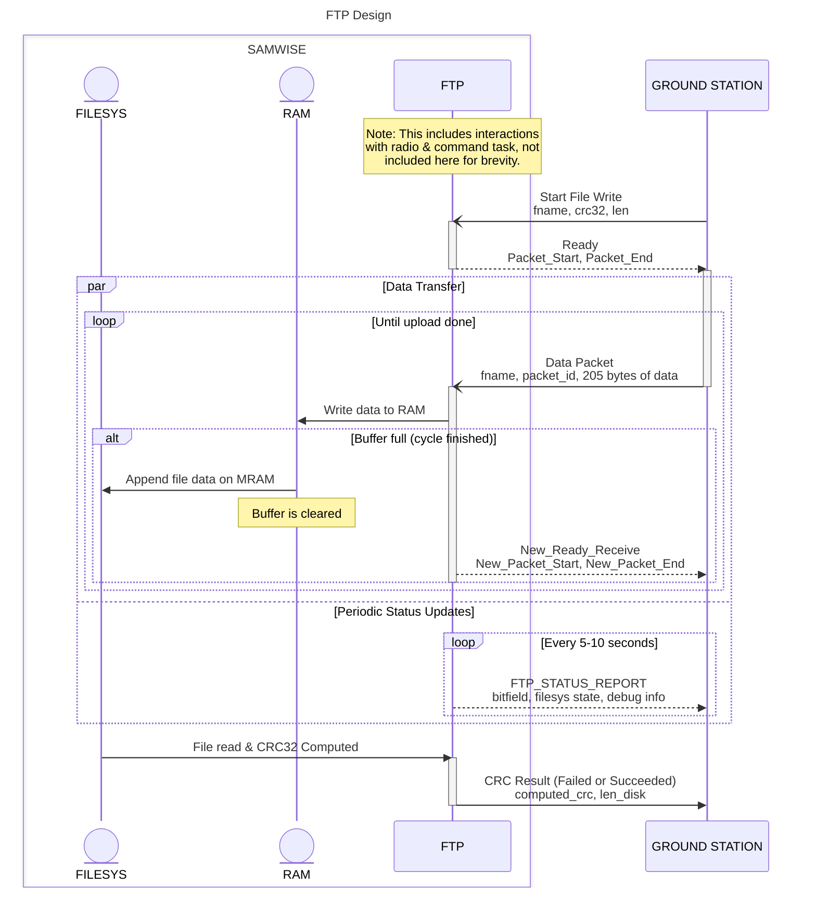
```mermaid
---
title: FTP Design
---
sequenceDiagram
    box SAMWISE
        participant FILESYS@{ "type": "entity" }
        participant RAM@{ "type": "entity" }
        participant FTP
    end
    participant GROUND STATION

    Note over FTP: Note: This includes interactions<br />with radio & command task, not <br/>included here for brevity.
    GROUND STATION-)FTP: Start File Write<br />fname, crc32, len
    activate FTP
    FTP-->>GROUND STATION: Ready<br />Packet_Start, Packet_End
    deactivate FTP
    activate GROUND STATION

    par Data Transfer
        loop Until upload done
            GROUND STATION-)FTP: Data Packet<br />fname, packet_id, 205 bytes of data
            deactivate GROUND STATION
            activate FTP
            FTP->>RAM: Write data to RAM
            alt Buffer full (cycle finished)
                RAM->>FILESYS: Append file data on MRAM
                Note over RAM: Buffer is cleared
                FTP-->>GROUND STATION: New_Ready_Receive<br />New_Packet_Start, New_Packet_End
            end
            deactivate FTP
        end
    and Periodic Status Updates
        loop Every 5-10 seconds
            FTP-->>GROUND STATION: FTP_STATUS_REPORT<br />bitfield, filesys state, debug info
        end
    end
    FILESYS->>FTP: File read & CRC32 Computed
    activate FTP
    FTP->>GROUND STATION: CRC Result (Failed or Succeeded)<br />computed_crc, len_disk
    deactivate FTP
```

We implement the following functions:
* reformat filesystem
* start file write
* write packet to buffer (automatically writes to file if all packets are received)
* cancel file write
* remove file
* list all files, their CRC32s, file sizes, & other metadata
* resume file write (re-initialize RAM metadata so write packet to buffer works if SAMWISE loses RAM data e.g. on restart)
* periodic status reporting with comprehensive debugging information

### Design Benefits
This periodic status update approach provides several advantages over per-packet responses:
* **Reduced bandwidth overhead**: Sends comprehensive status every 5-10 seconds instead of 32+ bytes per packet
* **Enhanced debugging**: Status reports include filesystem health, total bytes written, and partial file CRC
* **Improved reliability**: Less radio traffic reduces chance of important status information being lost
* **Better performance**: Lower processing overhead per data packet since no immediate response is required

Note this means we also **do not have** some common functionalities:
* upload multiple files at once
* directories
* non-two-byte file names

## Alt Designs
We had a couple of other designs we were thinking of, which ultimately were not pursued:
1. Write sequentially directly to MRAM
    * We expect high packet drop rates, so we cannot expect all packets to arrive in sequential order, or all packets to arrive at all
2. Write out of order directly to MRAM any time we receive a new packet (i.e. eliminate RAM buffer entirely)
    * (a) This would cause the Ground Station to essentially cycle through all packets infinitely until we finally get everything into MRAM, as dropped packets means that we could have only packet 10 dropped and still have to cycle through the next 400 packets before getting back to sending packet 10
       * It's better to have a system where we can know when we've finished a segment, so we avoid this crazy scenario
    * (b) This would be very inefficient for the MRAM, as we only write ~205 bytes at a time, that too out-of-order
        * Both little-fs and MRAMs do not like this - it would be better to somehow keep sequential writes
    * (c) Similar to (b), more writes & operations on MRAM = more wear & tear/lower lifetime of MRAM
        * We need to minimize these writes
3. Fit entire file into RAM
    * Obvious issue: we don't have enough RAM!

And more, but these should highlight the reasoning we went through to arrive at this design.

## Choosing N
Based on our knowledge of alt designs and our own design, here are the tradeoffs you need to consider when choosing a value for N:

_Too high:_
* Limited by space on RAM, i.e. buffer size cannot be too large
* The point of "cycling" is to prevent needing to send all the packets repeatedly from Ground -> SAMWISE. (See 2a above). Having a higher N could make this "harder".
    * Note that this is not really that big of an issue, as we now provide a bitfield of packets we haven't received yet (see `FTP_READY_RECEIVE` specifications). However, it is possible for this to be a bit finicky still (e.g. it is not that easy for ground station to quickly adapt to this bitfield, especially if it is still cycling through hundreds of disjointed packets and bitfields are changing weirdly every time SAMWISE returns `FTP_READY_RECEIVE`).
* More susceptible to losing a lot of data already uploaded. For example, if I sent 300/400 packets, but SAMWISE suddenly restarts for whatever reason, then I have to resend all 400 packets as RAM is cleared on restart. RAM is also in general pretty volatile, so it is not the best idea to keep so much data in RAM (much safer to flush to MRAM).
* Similar to above, less opportunities for "checkpoints" where you can continue from (see "resume file write" functionality in Overall Design).

_Too low:_
* High MRAM writes, which will degrade MRAM's lifetime. We need to limit these as much as possible.
* Very high overhead from having to repeatedly go to the next cycle. For really large files, this could be a BIG problem, as it would take ages to upload the file completely.
* Similar to above, lots of unnecessary operations that clog up SAMWISE and Ground Station functionality, not only radio link but processing as well (specifically on SAMWISE).

The relevant issue to track this is [#253](https://github.com/stanford-ssi/samwise-flight-software/issues/253).

## Testing
We want to be able to test on each level possible. So:
1. We test our MRAM drivers with unit tests. This should be done on the hardware, so something like [#237](https://github.com/stanford-ssi/samwise-flight-software/issues/237) needs to be implemented.
    * NO mock of MRAM.
2. We test our Filesys implementation with unit tests, to see if the API to the MRAM works properly, including writing functionality (e.g. data -> buffer -> mram cycle)
    * MRAM is mocked out here.
3. Test our Filesys implementation on the actual hardware, to make sure LFS is truly being used properly.
    * NO mock of MRAM.
4. We have "unit tests" in FTP that will send fake packets to poke around certain functionality or code paths. This tests the logic behind file writes and especially how codes are sent back.
    * MRAM is mocked out here.
5. We will have a full-scale test of the entire system with mocked out functions, using a test_scheduler and visualization library.
    * MRAM is mocked out here.
6. Full on-hardware test, lumping everything together onto the testing satellite.
    * This is the full test of everything, so nothing is mocked at all!

There are a few considerations (really with testing of anything), that I can reiterate here:
* Make sure that there is NO CRASHING BEHAVIOR! We never want to terminate the program on error.
* Try to test really weird edge cases as well as the "most likely" path through. This doc is meant to try to also describe all of these edge cases, but there can be some that fall through.
* Always test smaller functions and build up afterward (general unit test advice).

## Entire Algorithm

### 0. Initialize & reformat
FTP automatically initializes little-fs. On error, it will send FILESYS_INIT_ERROR.

If this is received, or for any other reason, you can reformat the entire MRAM. THIS IS DESTRUCTIVE!!

To do so, simply send a FTP_REFORMAT command with no body. If successful, FILESYS_REFORMAT_SUCCESS will be sent - otherwise, FILESYS_REFORMAT_ERROR will be sent.

### 1. Start a file write
To start writing a file, first make sure that no file is currently being written. If one is, FTP will return a FTP_ERROR_ALREADY_WRITING_FILE.

Otherwise, send a FTP_START_FILE_WRITE command with the following body:
```c
uint16_t fname; // Name of the file, maximum 2 bytes
uint16_t file_len; // Length of the file, maximum 2 bytes
uint32_t file_crc; // CRC32 for file validation after write
```

If successful, we will return FTP_READY_RECEIVE. Otherwise, FTP_ERROR_START_FILE_WRITE will be sent.

### 2. Send packets of data & finishing file write
#### Initial Writing
When you first start a file write, it will return the packets currently readable (`Packet_Start` and `Packet_End` inclusive), including a bitfield of the packets its still expecting.

Only packets in this range will be accepted, others will fail with an FTP_ERROR_PACKET_OUT_OF_RANGE. **This is VERY important for the ground station to realize/implement, lest an infinite loop of sending incorrect packets clog up the communications.**

If a file is not being written, it will return FTP_ERROR_NOT_WRITING_FILE.

This is the following body for a packet of data:
```c
uint16_t fname; // Name of the file, for reference/checks
uint16_t packet_id; // Packet id, which should fall within Packet_Start and Packet_End.
uint8_t[205] data; // Raw data to be put in this section
```

Note that data_len in the packet is used to determine the length of data - this example only shows the maximum amount, WHICH MUST BE USED FOR NON-FINAL PACKETS. **If the maximum amount is not used, there will be zero-ed out memory in the gap between the end of this packet and the start of the next.** // TODO: Check this in FTP

If an error occurs when writing to buffer, it will return FTP_FILE_WRITE_BUFFER_ERROR.

#### Periodic Status Updates
During normal packet reception, FTP does not send immediate responses to reduce radio overhead. Instead, periodic FTP_STATUS_REPORT packets are sent every 5-10 seconds containing:
* Current packet range (packet_start, packet_end)
* 32-byte bitfield showing which packets have been received
* Total bytes written to MRAM so far
* Partial file CRC for verification
* Filesystem writing state for debugging

This approach significantly reduces bandwidth usage while providing comprehensive debugging information.

#### Ending a cycle
If, on the last packet received on cycle, a little-fs error occurs, it will return FTP_FILE_WRITE_MRAM_ERROR.

If not on the last cycle and the cycle is completed successfully, it will return FTP_READY_RECEIVE with a new range of Packet_Start to Packet_End it will now accept. This is the only time an immediate response is sent, as it signals the start of a new cycle.

#### Ending a file
If on the last cycle, we start wrapping up the file writing process.

If a computed CRC32 of the file doesn't match uploaded file_crc, then FTP_EOF_CRC_ERROR will be thrown. If any other error occurs during CRC computation, FTP_FILE_WRITE_MRAM_ERROR is thrown.

Finally, if everything works out, FTP_EOF_SUCCESS is sent, along with the file length on disk and the computed crc.

### 2.1 Cancel file write
If, for any reason, you want to cancel a file write while writing, simply send a FTP_CANCEL_FILE_WRITE with the following body:
```c
uint16_t fname; // Name of the file
```
This will clear the buffer, remove any existing parts of the file from MRAM, and reset FTP to allow for continuation. On success, it returns FTP_CANCEL_SUCCESS - on error, it returns FTP_CANCEL_ERROR.

Note that if the FTP system is completely botched, reformatting should be the best option to attempt to completely fix it.

### 3. Removing a file
To remove a file, simply send a FTP_REMOVE_FILE command with the following body:
```c
uint16_t fname; // Name of the file
```

This will remove the file from the MRAM, returning a FTP_REMOVE_SUCCESS on completion, or FTP_REMOVE_ERROR if failed. You can always reformat the MRAM to make a last-ditch save & have memory left.

### 4. General errors
Finally, a general error is defined, FTP_ERROR. This is rarely used (not as of time of writing this doc), but should be known to the ground station.

Additionally, many errors include char[] data that may extend after its actual data. These are optional and should be treated as c-strings. Currently, none are implemented, but there may be room for some in the future.

## Packet Path through SAMWISE
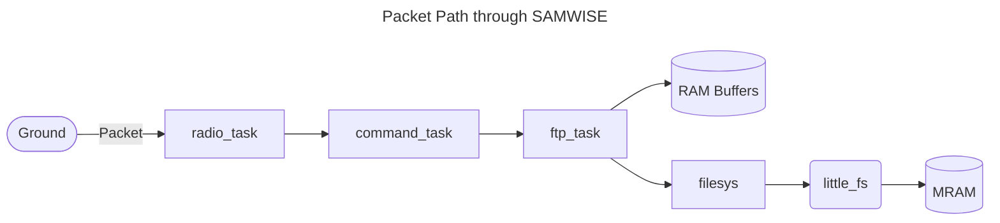
```mermaid
---
title: Packet Path through SAMWISE
---
flowchart LR
    GS([Ground]) -- Packet --> radio_task
    radio_task --> command_task --> ftp_task
    ftp_task --> RAM[(RAM Buffers)]
    ftp_task --> filesys --> lfs(little_fs) --> MRAM[(MRAM)]
```

## Useful Constants
All of these are present in `config.h`:
* `FTP_NUM_PACKETS_PER_CYCLE` = `N` (in this doc) - The amount of packets uploaded per cycle. Currently set to 256.
* `FTP_DATA_PAYLOAD_SIZE` - The amount of file data stored in a single packet, or `205 bytes`.
* `FTP_MAX_FILE_LEN` - The maximum file length that can possibly be uploaded using this design. It is calculated by `2^16 * 205 = 13434880 bytes` (about `~12.8 MiB`), which is the maximum number of packets per file times the amount of data uploaded in each packet. Note that this is MUCH bigger than the maximum allowed in MRAM `512 KiB`.
* `FILESYS_BUFFER_SIZE` - The amount of data buffered in RAM every cycle. This is handled by Filesys, but is relevant to FTP, so it is included here. This is simply `FTP_DATA_PAYLOAD_SIZE * FTP_NUM_PACKETS_PER_CYCLE = 205 bytes * 256 = 52480 bytes`.

Here are some other calculations to justify design decisions:
* The file length is stored in a 32-bit unsigned integer, which allows `2^32 = 4294967296 bytes = 4096 MiB` maximum. Note this should never be reached, it just should be greater than `FTP_MAX_FILE_LEN`.
* A maximum of `2^16 - 2 = 65534` file names can be stored on filesys. **Note that `0x0` in a filename for any of the bytes is not allowed, as LFS handles these as C-strings!** (Hence the subtraction by 2).
* Setting `N` takes `150 * 1024 / (205 * N)` cycles and `205 * N` bytes of buffered memory on SRAM to complete a 150KiB file, which we estimate as the binary size. Therefore, `N = 256` takes approximately 3 cycles to finish with `51.25KiB` of space being taken on SRAM.

## Packet Formatting (Ground Station -> SAMWISE)
**NOTE:** This only shows the `data` field of a sample packet, as defined by the radio task. There are many more attributes that must be added outside of these FTP-specific ones!
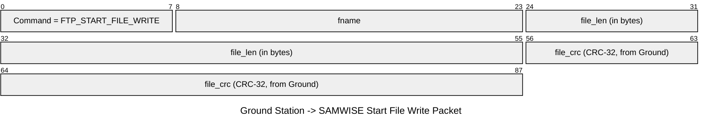
```mermaid
---
title: Ground Station -> SAMWISE Start File Write Packet
---
packet
+8: "Command = FTP_START_FILE_WRITE"
+16: "fname"
+32: "file_len (in bytes)"
+32: "file_crc (CRC-32, from Ground)"
```
---
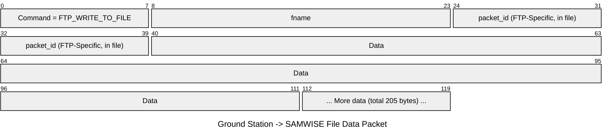
```mermaid
---
title: Ground Station -> SAMWISE File Data Packet
---
packet
+8: "Command = FTP_WRITE_TO_FILE"
+16: "fname"
+16: "packet_id (FTP-Specific, in file)"
+72: "Data"
+8: "... More data (total 205 bytes) ..."
```
---
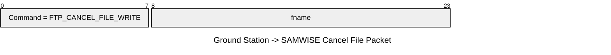
```mermaid
---
title: Ground Station -> SAMWISE Cancel File Packet
---
packet
+8: "Command = FTP_CANCEL_FILE_WRITE"
+16: "fname"
```

## Packet Formatting (SAMWISE -> Ground Station)
Each packet has its own `FTP_Result`, as described below. All fields are unsigned except for those marked with `(signed)`.

**NOTE:** If there is no file being written, then the first three headers have the following values. This will always occur on `FILESYS_INIT_ERROR`, for example.
* `fname` = `'XX'`
* `file_len` = `0`
* `file_crc` = `0`

**NOTE 2:** Most of these packets have optional "Additional Data" fields which can store a bunch of free standing characters (a C-string). This is currently not implemented, but kept in the design just in case we implement e.g. log dumping capabilities.

### No Additional Data Packets
*These can still store optional C-strings, as noted in Note 2*

For (success): `FILESYS_REFORMAT_SUCCESS`, `FTP_CANCEL_SUCCESS`

For (error): `FTP_ERROR_NOT_WRITING_FILE`, `FTP_ERROR`

`FTP_ERROR` is not really used, but is provided as a backup just in case an error arises out of scope of this design doc.
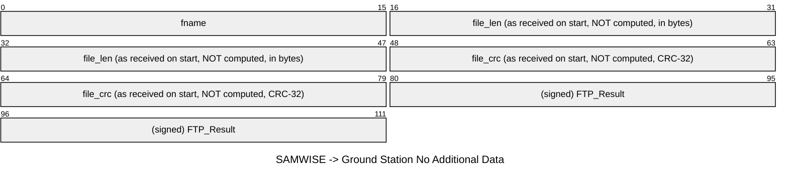
```mermaid
---
title: SAMWISE -> Ground Station No Additional Data
---
packet
+16: "fname"
+32: "file_len (as received on start, NOT computed, in bytes)"
+32: "file_crc (as received on start, NOT computed, CRC-32)"
+32: "(signed) FTP_Result"
```

### Cycle Status Packets
For (success): `FTP_READY_RECEIVE` (sent only on cycle completion)

For (error): `FTP_ERROR_PACKET_OUT_OF_RANGE`

Note that `FTP_READY_RECEIVE` is now only sent when a cycle completes, containing New_Packet_Start and New_Packet_End to signify the start of a new cycle.

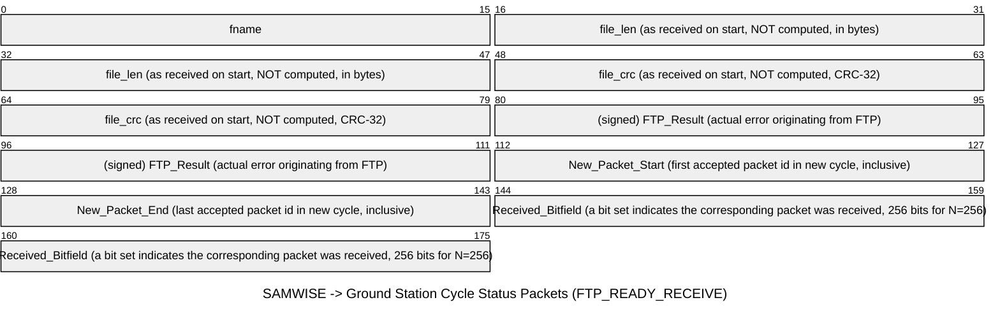
```mermaid
---
title: SAMWISE -> Ground Station Cycle Status Packets (FTP_READY_RECEIVE)
---
packet
+16: "fname"
+32: "file_len (as received on start, NOT computed, in bytes)"
+32: "file_crc (as received on start, NOT computed, CRC-32)"
+32: "(signed) FTP_Result (actual error originating from FTP)"
+16: "New_Packet_Start (first accepted packet id in new cycle, inclusive)"
+16: "New_Packet_End (last accepted packet id in new cycle, inclusive)"
+32: "Received_Bitfield (a bit set indicates the corresponding packet was received, 256 bits for N=256)"
```

### Periodic Status Report Packets
For periodic updates: `FTP_STATUS_REPORT` (sent every 5-10 seconds during file transfer)

This packet provides comprehensive debugging information about the current FTP and filesystem state without the overhead of per-packet responses.

```c
typedef struct {
    uint16_t fname;                    // Current file being written
    uint32_t file_len;                 // File length being written
    uint32_t file_crc;                 // Expected file CRC
    uint16_t packet_start;             // Current cycle's start packet
    uint16_t packet_end;               // Current cycle's end packet
    uint8_t received_bitfield[32];     // 256-bit bitfield (32 bytes)
    
    // Additional filesystem & FTP state info for debugging:
    uint32_t total_bytes_written;      // Total bytes written to MRAM so far
    uint32_t file_crc_so_far;          // CRC of the file so far as it currently sits on the MRAM, which ground station may use for verification during file transfer (using total_bytes_written). This should be 0 if nothing has been written so far (first cycle).
    uint8_t filesys_is_writing_file;   // Internal state - if filesys is currently writing a file
} __attribute__((packed)) FTP_STATUS_REPORT_DATA;
```

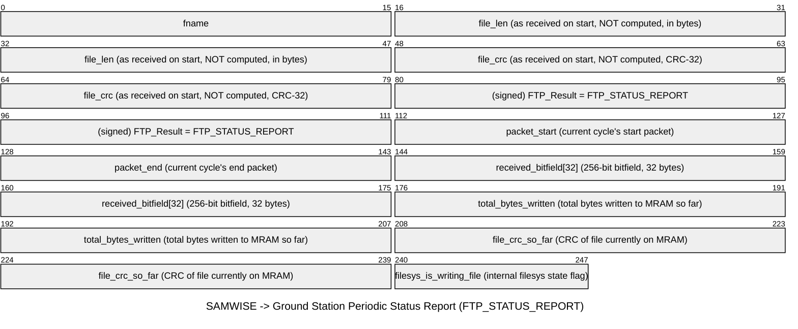
```mermaid
---
title: SAMWISE -> Ground Station Periodic Status Report (FTP_STATUS_REPORT)
---
packet
+16: "fname"
+32: "file_len (as received on start, NOT computed, in bytes)"
+32: "file_crc (as received on start, NOT computed, CRC-32)"
+32: "(signed) FTP_Result = FTP_STATUS_REPORT"
+16: "packet_start (current cycle's start packet)"
+16: "packet_end (current cycle's end packet)"
+32: "received_bitfield[32] (256-bit bitfield, 32 bytes)"
+32: "total_bytes_written (total bytes written to MRAM so far)"
+32: "file_crc_so_far (CRC of file currently on MRAM)"
+8: "filesys_is_writing_file (internal filesys state flag)"
```

### FTP_EOF_SUCCESS and FTP_EOF_CRC_ERROR
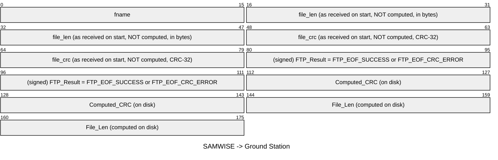
```mermaid
---
title: SAMWISE -> Ground Station
---
packet
+16: "fname"
+32: "file_len (as received on start, NOT computed, in bytes)"
+32: "file_crc (as received on start, NOT computed, CRC-32)"
+32: "(signed) FTP_Result = FTP_EOF_SUCCESS or FTP_EOF_CRC_ERROR"
+32: "Computed_CRC (on disk)"
+32: "File_Len (computed on disk)"
```

### Filesys & LFS Error Packet
For (error): `FILESYS_INIT_ERROR`, `FILESYS_REFORMAT_ERROR`, `FTP_FILE_WRITE_ERROR`, `FTP_CANCEL_ERROR`, `FTP_ERROR_START_FILE_WRITE`, `FTP_FILE_WRITE_BUFFER_ERROR`, `FTP_FILE_WRITE_MRAM_ERROR`

**Note:** This error packet is a bit complicated. Either of the two possible outcomes can occur:
1. If the error happened with Little-FS (LFS), then BOTH `Filesys Error Code` and `LFS Error Code` will be filled.
2. If the error happened only on Filesys (e.g. `FTP_FILE_WRITE_BUFFER_ERROR`, which only interacts with RAM and not LFS), then `Filesys Error Code` will be populated, but `LFS Error Code` == `LFS_ERR_OK` (indicating that it was a filesys error).

In both cases, Filesys error should be always populated.

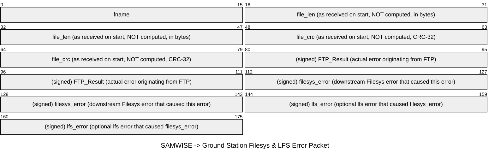
```mermaid
---
title: SAMWISE -> Ground Station Filesys & LFS Error Packet
---
packet
+16: "fname"
+32: "file_len (as received on start, NOT computed, in bytes)"
+32: "file_crc (as received on start, NOT computed, CRC-32)"
+32: "(signed) FTP_Result (actual error originating from FTP)"
+32: "(signed) filesys_error (downstream Filesys error that caused this error)"
+32: "(signed) lfs_error (optional lfs error that caused filesys_error)"
```

### FTP_ERROR_START_FILE_WRITE
Very similar to LFS Error Packet, except it also returns the number of blocks left on disk, as this is computed during start file write, and can be useful for debugging purposes.

Note that if the start file ended early, "blocks left on disk" may be -1. This simply indicates it was never calculated, not necessarily that there is a major issue happening.
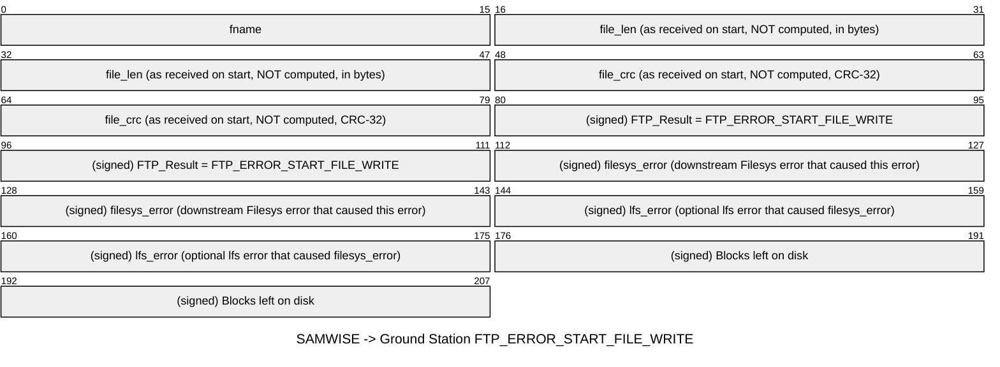
```mermaid
---
title: SAMWISE -> Ground Station FTP_ERROR_START_FILE_WRITE
---
packet
+16: "fname"
+32: "file_len (as received on start, NOT computed, in bytes)"
+32: "file_crc (as received on start, NOT computed, CRC-32)"
+32: "(signed) FTP_Result = FTP_ERROR_START_FILE_WRITE"
+32: "(signed) filesys_error (downstream Filesys error that caused this error)"
+32: "(signed) lfs_error (optional lfs error that caused filesys_error)"
+32: "(signed) Blocks left on disk"
```
